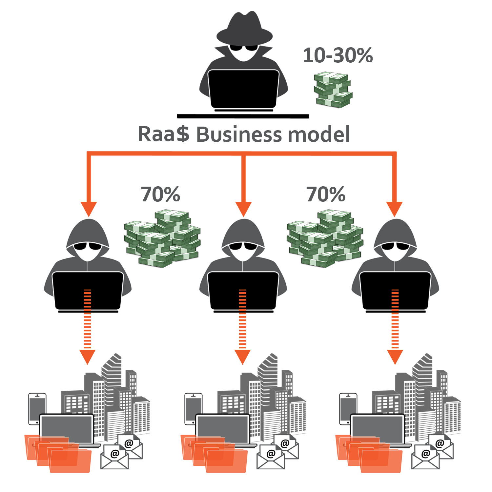

```{r setup, include=FALSE}
library(dplyr)
library(readr)
library(tidyr)
library(ggplot2)
library(magrittr)
library(corrplot)
library(reshape)
library(plotly)
library(lubridate)
library(ggridges)
library(forcats)
library(shiny)
library(stringr)
library(viridis)
library(knitr)
library(DT)
library(ggridges)
library(forcats)
library(reshape2)


attacks <- read_csv("attacks_finalfinal.csv", show_col_types = FALSE)
attacks$`Victim Country`[attacks$`Victim Country` == "Non Disponibile"] <- NA
attacks$`Victim Country`[attacks$`Victim Country` == "usa"] <- "USA"
ttps <- read_csv("groups_finalfinal.csv", show_col_types = FALSE)
```

## Project Contents 
- Custom dataset created by [DarkLab](https://www.redhotcyber.com/post/nasce-dark-lab-il-team-di-cyber-threat-intelligence-della-community-di-red-hot-cyber/) (by **Pietro Melillo**) part of [RedHotCyber](https://www.redhotcyber.com/)
- Data from 2020 to 2025
- Exploration, analysis and visualization of the **R-a-a-S phenomenology** starting from threats' impact 
- Data already cleaned in the first phase of the project

{#id .class width=30% height=30%}     &nbsp;&nbsp;&nbsp;&nbsp;&nbsp;&nbsp;&nbsp;&nbsp;&nbsp;&nbsp;&nbsp;&nbsp;&nbsp;&nbsp;&nbsp;&nbsp;&nbsp;&nbsp;&nbsp;&nbsp;&nbsp;&nbsp;&nbsp;&nbsp;&nbsp;&nbsp;&nbsp;&nbsp;&nbsp;&nbsp;&nbsp;&nbsp;&nbsp;&nbsp;&nbsp;&nbsp;&nbsp;&nbsp;&nbsp;&nbsp;&nbsp;&nbsp;&nbsp;&nbsp;&nbsp;&nbsp;&nbsp;&nbsp;&nbsp;&nbsp;                      {#id .class width=30% height=30%}     


## Ransomware-as-a-Service & Criminal Ecosystem
- First ransomware discovered in 1996 (**AIDS**)
- In late 2010s digital criminal underground environment started to grow
- RaaS business model formation in 2019
- Currently one of the most consistent and impactful threats in the whole landscape  
- Double extortion operations as main monetization model
- 100+ concurrent active RaaS


<div style="display: inline-block; margin-right: 10px;">
   
</div>
<div style="display: inline-block;">
   
</div>

## Dataset \#1

```{r cars, echo = TRUE}
names(attacks)
```
```{r}
nrow(attacks)
```

```{r}
attacks %>% filter(ID == 1) %>% pull(date)
```

```{r}
datatable(head(attacks)) 
```

## Dataset \#2
```{r}
names(ttps)[0:10]
```

```{r}
length(names(ttps))
```

```{r}
datatable(ttps %>% filter(Group == "Lockbit3")) 
```

## Sectors and Countries

```{r, include=FALSE}
knitr::opts_chunk$set(warning = FALSE, message = FALSE) 
timeserie1 <- attacks %>%
  mutate(date = dmy(date)) %>%
  group_by(`Victim Country`, year = year(date), month = month(date)) %>%
  summarize(tot_attacks = n()) %>% 
  mutate(datafin = format(as.Date(make_date(year, month)), "%Y-%m"))

# Top 5 victim countries
attacksperstate <- timeserie1 %>%
  group_by(`Victim Country`) %>%
  summarize(totalatk = sum(tot_attacks)) %>%
  arrange(desc(totalatk)) 

top5 <- attacksperstate$`Victim Country`[1:5]

timeserie1 <- timeserie1 %>% filter(`Victim Country` %in% top5) %>% filter(!is.na(year)) %>% mutate(datafin = as.Date(paste0(year, "-", month, "-01"))) 

head(timeserie1)

timeserie11 <- timeserie1 %>%
  mutate(Victim_Country = reorder(`Victim Country`, -tot_attacks))

timeserie11$Victim_Country <- factor(timeserie11$Victim_Country, levels = top5)
timeserie11$Victim_Country <- paste(timeserie11$Victim_Country, " (", attacksperstate$totalatk[match(timeserie11$Victim_Country, attacksperstate$`Victim Country`)], ")")

labels <- timeserie11 %>% group_by(Victim_Country) %>%  select(`Victim Country`, Victim_Country) %>% distinct(`Victim Country`) %>% mutate(order = factor(`Victim Country`, levels = top5)) %>% arrange(order) %>% pull(Victim_Country)


didit <- ggplot(timeserie11, aes(x = datafin, y = factor(`Victim Country`, levels = rev(top5)), height = tot_attacks, fill = `Victim Country`)) + 
  geom_density_ridges(stat = "identity", scale=6, jit=0.05) +
  labs(x="", y = "", fill = "Paese vittima") +
  theme_ridges() +
  scale_x_date(date_labels = "%Y", date_breaks = "1 year") +
  scale_fill_discrete(name = "Paese vittima (Totale attacchi)", labels = labels) +
  theme_linedraw()


p <- ggplotly(didit) %>%
  layout(legend = list(title = list(text = "Paese vittima (Totale attacchi)")), width = 1800, height = 500) 


p$x$data[[1]]$name <- labels[1]
p$x$data[[2]]$name <- labels[1] 
p$x$data[[3]]$name <- labels[2] 
p$x$data[[4]]$name <- labels[2] 
p$x$data[[5]]$name <- labels[3] 
p$x$data[[6]]$name <- labels[3] 
p$x$data[[7]]$name <- labels[4] 
p$x$data[[8]]$name <- labels[4] 
p$x$data[[9]]$name <- labels[5] 
p$x$data[[10]]$name <- labels[5] 
```

```{r, echo=FALSE}
p
```


```{r, echo=FALSE}
naivesectors <- attacks


naivesectors2 <- naivesectors %>% 
                  filter(!is.na(date)) %>%
                  mutate(date = dmy(date), year = year(date), month = month(date)) %>% 
                  group_by(`Victim Country`, `Victim sectors`, year, month) %>% 
                  summarize(total_attacks = n()) %>% 
                  ungroup() 


top5sec   <- naivesectors2 %>% 
                group_by(`Victim sectors`) %>% 
                summarize(tot_glob = sum(total_attacks)) %>% 
                arrange(desc(tot_glob)) %>% 
                top_n(5) %>% 
                select(`Victim sectors`)

                  

labelssec <- naivesectors2 %>% 
              group_by(`Victim sectors`) %>% 
              summarize(tot_glob = sum(total_attacks)) %>% 
              arrange(desc(tot_glob)) %>% 
              top_n(5) %>% 
              mutate(label = paste0(`Victim sectors`, " (", tot_glob, ")")) %>% 
              pull(label)
              


naivesectors3 <- naivesectors2 %>% mutate(datafin = as.Date(paste0(year, "-", month, "-01"))) 
naivesectors3$`Victim sectors` <- factor(naivesectors3$`Victim sectors`, levels = top5sec$`Victim sectors`) 

naivesectors3 <- naivesectors3 %>%  filter(!is.na(`Victim sectors`)) 


naivesectors3_mensile <- naivesectors3 %>%
                          group_by(month, year,`Victim sectors`, datafin) %>%
                          summarise(total_attacchi_mensile = sum(total_attacks)) %>% 
                          filter(!is.na(year)) %>% filter(year != "2025") %>% filter(!is.na(`Victim sectors`))


diditsec <- ggplot(naivesectors3_mensile, aes(x = datafin, y = fct_reorder(`Victim sectors`, total_attacchi_mensile, .desc = FALSE), height = total_attacchi_mensile, fill = `Victim sectors`)) +
  geom_density_ridges(stat = "identity", scale = 1.25, jit = 0.1) +
  labs(x = "Mese", y = "", fill = "Totale attacchi mensili") +
  theme_ridges() +
  theme_linedraw()


psectors <- ggplotly(diditsec) %>% layout(legend = list(title = list(text = "Paese vittima (Totale attacchi)")), width = 1800, height = 500)


psectors$x$data[[1]]$name <- labelssec[1]
psectors$x$data[[2]]$name <- labelssec[1]
psectors$x$data[[3]]$name <- labelssec[2]
psectors$x$data[[4]]$name <- labelssec[2]
psectors$x$data[[5]]$name <- labelssec[3]
psectors$x$data[[6]]$name <- labelssec[3]
psectors$x$data[[7]]$name <- labelssec[4]
psectors$x$data[[8]]$name <- labelssec[4]
psectors$x$data[[9]]$name <- labelssec[5]
psectors$x$data[[10]]$name <- labelssec[5]


```

```{r, echo=FALSE}
psectors
```

## 

```{r, echo=FALSE}

#targets <- c("INDUSTRIAL", "SERVICES", "TECHNOLOGIES", "HEALTHCARE", "CONSTRUCTION")

targets <- c("CONSTRUCTION", "HEALTHCARE", "TECHNOLOGIES", "SERVICES", "INDUSTRIAL")

heatmap_data <- naivesectors2 %>%
  group_by(`Victim Country`, `Victim sectors`)  %>%
  summarize(total_attacks = sum(total_attacks)) %>%
  group_by(`Victim Country`) %>%
  mutate(total_attacks_country = sum(total_attacks),
  proportion = total_attacks / total_attacks_country) %>%
  ungroup()


top5sectors <- naivesectors2 %>% 
                group_by(`Victim sectors`) %>% 
                summarize(tot_glob = sum(total_attacks)) %>% 
                arrange(desc(tot_glob)) %>% 
                top_n(5) %>% 
                select(`Victim sectors`)

heatmap_data_top5 <- heatmap_data %>% filter(`Victim sectors` %in% top5sectors$`Victim sectors`)  %>% mutate(`Victim sectors` = factor(`Victim sectors`, levels = targets))


heatmap_data_wide <- heatmap_data_top5 %>%
  pivot_wider(names_from = `Victim sectors`, values_from = proportion) %>%
  mutate(across(c(CONSTRUCTION, HEALTHCARE, TECHNOLOGIES, SERVICES, INDUSTRIAL), ~replace_na(., 0)))


options(repr.plot.width =500, repr.plot.height =500) 


heatmenow <- ggplot(data = heatmap_data_top5, aes(x = `Victim Country`, y = `Victim sectors`, fill = proportion)) +
              geom_tile() +
              scale_fill_gradient(low = "white", high = "purple", labels = scales::percent) +
              labs(x = "Paese", y = "Settore", fill = "Percentuale di attacchi") +
              theme(axis.text.x = element_text(angle = 45, hjust = 1))


ggplotly(heatmenow) %>% layout(width = 2200, height = 1200)

```


## Groups & Top5 Sectors
```{r, echo=FALSE}
targets <- c("INDUSTRIAL", "SERVICES", "TECHNOLOGIES", "HEALTHCARE", "CONSTRUCTION")

atk_sec_gangtop15  <- attacks %>% group_by(`Victim sectors`, gang) %>% summarise(attacks_sector = n()) %>% filter(`Victim sectors` %in% targets) %>% arrange(desc(attacks_sector)) %>% group_by(`Victim sectors`) %>% mutate(rank = row_number()) %>%  arrange(`Victim sectors`, rank) %>% filter(rank < 16)


create_radar_chart <- function(data, sector) {

  # Filter data for the specific sector
atk_filtered <- data %>%  filter(`Victim sectors` == sector) %>% group_by(gang) %>% arrange(desc(attacks_sector))


max_value <- atk_filtered %>% filter(rank == 1) %>% pull(attacks_sector)

atk_filtered <- atk_filtered %>% mutate(valfin = attacks_sector/max_value)


ggplot(atk_filtered, aes(x = reorder(gang, +attacks_sector), y = attacks_sector, fill = attacks_sector)) +
  geom_polygon(aes(x = reorder(gang, +attacks_sector), y = attacks_sector, fill = attacks_sector), alpha = 0.5) +
  geom_bar(stat = "identity", aes(x = reorder(gang, +attacks_sector), y = attacks_sector, fill = attacks_sector)) + 
  labs(x = "Ransomware Group", y = "Normalized Attack Frequency") +
  theme_minimal() + 
  theme(axis.text.x = element_text(size = 24)) +
  theme(legend.text = element_text(size = 24)) +
  theme(axis.text.x = element_text(angle = 45, hjust = 1)) +
  scale_fill_gradientn(colours = c( "#6C5B7B","#C06C84","#F67280","#F8B195"), limits = c(0, max_value)) +
  coord_polar() 
}


ui <- fluidPage(titlePanel("Radar Chart of Ransomware Groups by Sector"),
                selectInput("selected_sector", "Scegli :", choices = targets),
                plotOutput("radar_plot", width = "1000px", height = "1000px"))

server <- function(input, output){
  output$radar_plot <- renderPlot({create_radar_chart(atk_sec_gangtop15, input$selected_sector)}, height = 800, width = 800)
}

#shinyApp(ui = ui, server = server)
vwr = dialogViewer('MyAppName', width = 1600, height = 1200)
shinyApp(ui = ui, server = server, options = list(width=1500, height = 1080))
```

## Conti post-mortem
```{r, echo=FALSE}
pivot_table <- atk_sec_gangtop15 %>%
                group_by(`Victim sectors`, gang) %>%
                summarize(count = n()) %>%
                pivot_wider(names_from = `Victim sectors`, values_from = count, values_fill = 0)


common_gangs <- pivot_table %>%
  filter(across(everything(), ~ . > 0)) %>%  # Modifica: controlla se il gruppo è presente in ogni settore almeno una volta
  select(gang)

filtered_common <- ttps %>% filter(Group %in% common_gangs$gang) %>% filter(!is.na(`Exit Date`))
```

```{r}
datatable(ttps %>% filter(Group %in% common_gangs$gang) %>% filter(!is.na(`Exit Date`)) %>% select(Group, `Exit Date`))
```

```{r, echo=FALSE}

ttp_matrix <- ttps %>%
  group_by(Group, TTPS) %>%
  summarize(count = n()) %>%
  pivot_wider(names_from = TTPS, values_from = count, values_fill = 0) %>% select(-"NA")


work_ttp <- ttps %>% unite("all_ttps", starts_with("TTPS"), na.rm = TRUE, sep = ", ") %>%  separate_rows(all_ttps, sep = ",") %>% select(ID,Group,all_ttps) %>% mutate(all_ttps = str_replace(all_ttps, "\\..*", "")) %>% group_by(Group, all_ttps) %>% summarise(count = n()) %>%  select(-count) %>%  filter(!is.na(all_ttps)) %>% filter(all_ttps != "")


conti_ttp <- work_ttp %>%  filter(Group == "Conti") %>% group_by(all_ttps) %>% pull(all_ttps)

conti_len <- length(conti_ttp)


total_ttp_groups <- work_ttp %>% group_by(Group) %>% summarise(total_ttp = n())

ttp_conti_near_fin <- work_ttp %>% mutate(is_in_conti = ifelse(all_ttps %in% conti_ttp, 1, 0)) %>% group_by(Group) %>% summarize(shared_ttps = sum(is_in_conti))


calc_ttps <- total_ttp_groups %>% full_join(ttp_conti_near_fin, by="Group")


group_continish <- c("Royal", "Blackbasta", "Quantum", "Xinglocker", "Astrolocker", "Meow", "3AM", "Threeam", "Akira", "Monti")

jaccard_ttps <- calc_ttps %>% mutate(jaccard_index = shared_ttps / (total_ttp + conti_len - shared_ttps)) %>% filter(Group != "Conti") %>% filter(Group %in% group_continish) %>% arrange(desc(jaccard_index))


  
  
jacard_plt <- ggplot(jaccard_ttps, aes(x = reorder(Group, jaccard_index), y = jaccard_index, fill = Group)) +
  geom_bar(stat = "identity") +
  coord_flip() +
  scale_fill_viridis_d(option = "D", name = "Gruppo") +  # Utilizziamo una scala di colori continua
  labs(x = "Gruppo Ransomware", y = "Indice di Jaccard", title = "Similarità dei gruppi ransomware a Conti") +
  theme_linedraw()


group_similar_conti <- group_continish
```
{#id .class width=90% height=70%} 

## 
```{r}
group_similar_conti
```

```{r}
ggplotly(jacard_plt)
```

<iframe src="contivic.html" width = 800 height = 600 style="position: absolute; top: 300px; right: 400px;"></iframe>

## Victims' Businesses Value

```{r, echo=FALSE}

attacks_sales <- attacks %>% filter(!is.na(Sales)) %>% mutate(sales_num = case_when(str_detect(Sales, "M") ~ as.numeric(str_extract(Sales, "\\d+")) / 1000,str_detect(Sales, "B") ~ as.numeric(str_extract(Sales, "\\d+")),TRUE ~ NA_real_))


saless <- attacks_sales %>% mutate(sales_class = cut(sales_num, breaks = c(0, 0.005, 0.050, 0.100, 0.250, 0.500, 1.00, Inf),labels = c("<5MLN", "5-50MLN", "50-100MLN", "100-250MLN", "250-500MLN", "500MLN-1BLN", "1BLN+"))) %>%
                                 select(-c(gang,`Victim Country`,`NumberN/AofN/Aemployees`, `Victim sectors`)) %>% mutate(date = as.Date(date, format = "%d/%m/%Y")) %>% mutate(mese = month(date), anno = year(date)) %>% select(-date) %>% filter(!is.na(sales_class)) %>% filter(!is.na(anno)) %>% filter(!is.na(mese))


attacks_sales_time <- saless %>%  group_by(anno, mese, sales_class) %>%  summarize(num_attacks = n()) %>% mutate(datafin = as.Date(paste0(anno, "-", mese, "-01"))) %>% filter(anno > 2019)


timemoneyplot <- ggplot(attacks_sales_time, aes(x = datafin, y = num_attacks, fill = sales_class)) +
  geom_area(position = "stack", colour="black", size=0.75, alpha=0.85) +
  scale_fill_viridis(discrete = T) +
  labs(x = "Anno", y = "Numero di attacchi", title = "Evoluzione degli attacchi per classe di fatturato nel tempo") +
  scale_x_date(date_labels = "%Y", date_breaks = "1 year") +
  theme_grey()


p2 <- ggplotly(timemoneyplot) %>% layout(legend = list(title = list(text = "Paese vittima (Totale attacchi)")), width = 1800, height = 500)

p2


average_sales_by_sector <- attacks_sales %>%
  group_by(`Victim sectors`) %>%
  summarize(avg_sales = mean(sales_num, na.rm = TRUE)) %>% filter(`Victim sectors` %in% targets) %>% mutate("Sales ($MLN)" = avg_sales * 100) %>% select(-avg_sales)

datatable(average_sales_by_sector)
```

## LockBit End(?)

<div style="display: grid; grid-template-columns: 1fr 1fr;">
  <div>
```{r, echo=FALSE}
knitr::opts_chunk$set(warning = FALSE, message = FALSE) 

atk_timeseries <- attacks %>%
                  mutate(date = as.Date(date, format = "%d/%m/%Y")) %>%
                  mutate(mese = month(date), anno = year(date)) %>%
                  group_by(anno, mese) %>% filter(!is.na(anno)) %>% filter(!is.na(mese)) %>% 
                  summarize(num_attacchi = n()) %>%  mutate(datafin = as.Date(paste0(anno, "-", mese, "-01"))) %>% filter(anno > 2020) %>% filter(anno < 2025)


mesi_picco <- atk_timeseries %>%
              group_by(anno) %>% 
              summarize(mese_picco = mese[which.max(num_attacchi)])


#ggplot(mesi_picco, aes(x = anno, y = mese_picco)) +
#  geom_col() +
#  labs(x = "Anno", y = "Mese con il picco massimo", title = "Mesi con il maggior numero di attacchi per anno")


atk_timeseries <- atk_timeseries %>% group_by(anno) %>% mutate(totale_anno = sum(num_attacchi)) %>% ungroup() %>% mutate(percentuale = (num_attacchi / totale_anno) * 100)

heatmap_data <- dcast(atk_timeseries, anno ~ mese, value.var = "percentuale")


#ggplot(melt(heatmap_data, id.vars = "anno", variable.name = "mese", value.name = "percentuale"), 
 #      aes(x = mese, y = anno, fill = percentuale)) +
  #geom_tile() +
  #scale_fill_gradient(low = "white", high = "red") +
  #labs(x = "Mese", y = "Anno", fill = "Numero di attacchi")


attacchi_mese <- attacks %>% mutate(date = as.Date(date, format = "%d/%m/%Y")) %>% mutate(mese = month(date), anno = year(date)) %>% group_by(anno, mese, gang) %>% summarize(num_attachi = n()) %>% filter(anno != 2020) %>% filter(anno != 2025)
  
attacchi_con_picco <- attacchi_mese %>% left_join(mesi_picco, by = "anno") %>% filter(mese == mese_picco) %>% select(-mese_picco)


top3_gruppi <- attacchi_con_picco %>%
                group_by(anno, mese) %>%
                arrange(desc(num_attachi)) %>%
                slice_head(n = 3) %>% 
                mutate(rank = row_number()) %>%
                filter(rank <= 3)


rank_plot <- ggplot(top3_gruppi, aes(x = reorder(gang, rank), y = num_attachi, fill = gang)) +
  geom_col() +
  facet_wrap(~ (anno), scales = "free_y", ncol = 1) +
  coord_flip() +
  labs(x = "Gruppo", y = "Numero di attacchi", title = "") +
  theme_minimal() +
  theme(legend.position = "none")


ggplotly(rank_plot) %>% layout(legend = list(title = list(text = "Paese vittima (Totale attacchi)")), height = 1000)
```
</div>
  <div>
    OPERATION CRONOS TIMELINE
    
    Febbruary 2024
      LockBit DLS and internal infrastructure seized by NCA
    
    May 2024
      Deanon of LBSupp and pubblication of first analysis
    
    October 2024
      EvilCorp recognized as LB affiliate and heavy US sanctions 
  </div>
</div>


##

```{r, echo=FALSE, fig.width=20}
knitr::opts_chunk$set(warning = FALSE, message = FALSE) 


LB_timeseries <- attacks %>%
                  mutate(date = as.Date(date, format = "%d/%m/%Y")) %>%
                  mutate(mese = month(date), anno = year(date)) %>%
                  group_by(anno, mese, gang) %>% filter(!is.na(anno)) %>% filter(!is.na(mese)) %>% 
                  filter(grepl("Lockbit", gang)) %>% 
                  summarize(num_attacchi = n()) %>%  mutate(datafin = as.Date(paste0(anno, "-", mese, "-01"))) 


plotLB <- ggplot(LB_timeseries, aes(x = datafin, y = num_attacchi)) +
            geom_line(color = "steelblue") +
            geom_smooth(method = "loess", se = FALSE, color = "red") +
            labs(x = "Mese-Anno", y = "Numero di attacchi", title = "LB attacks timeseries") +
            scale_x_date(date_labels = "%Y-%m", date_breaks = "1 year") +
            geom_area(fill="#69b3a2", alpha=0.4) +
            geom_point(size=3, color="#69b3a2") +
            geom_vline(xintercept = as.Date(c("2024-02-01", "2024-05-01", "2024-10-01")), linetype = "dashed", color = "black") +
            theme_minimal() 

plotLB
```

<iframe src="plotlyLB.html" width = 1000 height = 800></iframe>


```{r, echo=FALSE, warnings = FALSE}
knitr::opts_chunk$set(warning = FALSE, message = FALSE) 
attacchi_tot_glob <- attacks %>% mutate(date = as.Date(date, format = "%d/%m/%Y")) %>% mutate(anno = year(date)) %>% filter(anno < 2025) %>% group_by(anno) %>% summarize(tot_atks_year = n())
attacchi_groups_tot_glob <- attacks %>% mutate(date = as.Date(date, format = "%d/%m/%Y")) %>% mutate(anno = year(date)) %>% filter(anno < 2025) %>% group_by(gang, anno) %>% summarize(tot_atks = n())

percent_year_groups <- attacchi_groups_tot_glob %>%
                        group_by(anno) %>%
                        top_n(10, wt = tot_atks) %>% arrange(anno, desc(tot_atks)) %>% full_join(attacchi_tot_glob) %>% mutate(percentage_year = (tot_atks / tot_atks_year) * 100) %>% select(-c(tot_atks_year, tot_atks))

compute_top8_percent <- percent_year_groups %>% group_by(anno) %>% summarize(percentage_fin = sum(percentage_year))


ggplot(compute_top8_percent, aes(x = anno, y = percentage_fin)) +
  geom_col() +
  geom_smooth(method = "loess", se = FALSE, color = "red") +
  labs(x = "Anno", y = "Percentuale di attacchi dei top 10 gruppi", title = "Percentuale di attacchi effettuati dai top 10 gruppi per anno")
```


## Conclusions

1) Ransomware activities increased over the year with a strong focus on USA and other European countries
2) Regardless the high number of groups, the RaaS in the top10 makes 50%(+) of yearly attacks
3) Operators prefer Small/Medium companies than biger ones
4) Ransomware groups tends to change and adapt quickly 
5) Proactive contrast turned to be an effective solution against single groups changing the whole ecosystem balance

<br><br><br><br><br>

&nbsp;&nbsp;&nbsp;&nbsp;&nbsp;&nbsp;&nbsp;&nbsp;&nbsp;&nbsp;&nbsp;&nbsp;&nbsp;&nbsp;&nbsp;&nbsp;&nbsp;&nbsp;&nbsp;&nbsp;&nbsp;&nbsp;&nbsp;&nbsp;&nbsp;&nbsp;&nbsp;&nbsp;&nbsp;&nbsp;&nbsp;&nbsp;&nbsp;&nbsp;&nbsp;&nbsp;&nbsp;&nbsp;&nbsp;&nbsp;&nbsp;&nbsp;&nbsp;&nbsp;&nbsp;&nbsp;&nbsp;&nbsp;&nbsp;&nbsp;                      {#id .class width=60% height=60%} 